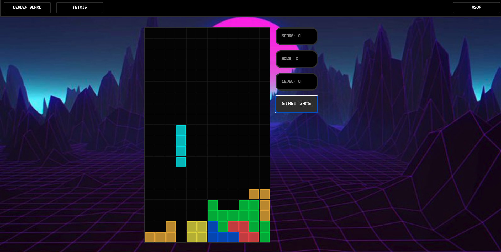
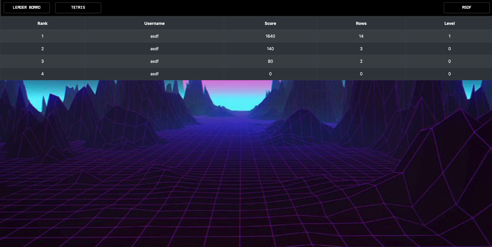

# Tetris in React

Tetris in React is the game Tetris built 100% in React.js. There are no game libraries used to help develop the game, everything is built using React, React Hooks and Styled Components. Users can sign in or create a new account, play the game, and view the leaderboard to see their scores

## Screen Shots

## Running / Setup Instructions

### Github Pages 

Head over to https://john-reiner.github.io/deploy_react_tetris you can create an account by clicking on the link above the submit button and start playing Tetris!

### Local Server

Clone and pull the repo. Run NPM Install and then NPM Start to sign in and play Tetris on your local machine. Visit localhost:3000/deploy_react_tetris

## Background Information

This was my Mod-4 React project for The Flatiron School Software Development Program. My partner and I decided to build a game in React.js for this project. The requirements were that we use Rails as a RESTful API on the backend. We decided that Users would have multiple scores (a One to Many relationship). To build the game I found a tutorial (https://www.youtube.com/watch?v=ZGOaCxX8HIU) for building the game Tetris all in React.js (no canvis). The Tutorial showed us how to use Hooks to manage the complex state that was needed to construct Tetris. We added to the front end by creating a login page and a leaderboard to make the game feel more like an arcade. Users can login, play the game, when the Application recognizes a "gameover" the score is posted to the backend Database linked to the logged in user.

### Technologies Used
  
  - React.js
    - React Hooks
    - React Custom Hooks
    - Styled Components
    - React Bootstrap
  - RESTful API
    - Built on Ruby on Rails
    